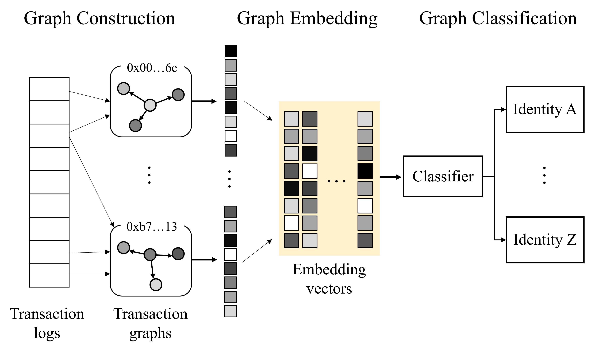

# Identity_Inference_on_Ethereum

### Abstract

This paper discusses an attack scenario that infers identity in a blockchain-based smart healthcare system. There is a privacy vulnerability because blockchain data is open to all participants. Invasion of privacy is a significant problem in a blockchain-based smart healthcare system that utilizes personal information. We analyze the blockchain graph to infer a user’s identity. Then, we construct account-transaction graphs using transactions on the blockchain. A graph embedding algorithm generates features of account-transaction graphs. The generated features are used to identify blockchain participants using machine learning algorithms. We evaluate our attack scenario by applying embedding algorithms in Ethereum. The results showed an inference performance of up to 0.94 in the f1-score.



### Requirements

The codebase is implemented in Python 3.7.10.
```
pickle  3.10.0
networkx  2.5
karateclub  1.2.2
scikit-learn  0.23.2
```

### Dataset

We collect data from XBlock, which is one of the blockchain data platforms in the academic community. XBlock is a data sets sharing platform designed to facilitate the development of blockchain research. We use a second-order transaction network of phishing nodes dataset in XBlock transaction-dataset. This dataset contains 1,660 verified phishing addresses reported in the list before October 17th, 2019, and randomly chosen 1,700 normal addresses. According to the list of the addresses, they crawled the transaction network of each address using the API provided by Etherscan. The transaction network consists of the first-order transaction network that consists of transactions between the target address and their neighbors and the second-order transaction network that consists of transactions between the first-order network and their neighbors. Each transaction contains sender, receiver, amount of transaction value, and timestamp of the transaction.

The datasets are available in [[here]](http://xblock.pro/tx/).

```
$ python make_graph/make_graph.py # make first-order transaction graph
```

```
$ python make_graph/make_secondgraph.py # make second-order transaction graph
```

In the root path, you need four folders of Second-order Transaction Network of Phishing Nodes downloaded from Xblock.

- Normal first-order nodes
- Normal second-order nodes
- Phishing first-order nodes
- Phishing second-order nodes

### Option

```
--graph			  STR		Order of transaction graphs(first, second).			    	Default is 'first'
--embedding		STR		Embedding algorithms(Feather-G, Graph2Vec, GL2Vec).		Default is 'Feather-G'.
--classifier	STR		Classifier(SVM, MLP, RF).								              Default is 'RF'.
```

### Example

The following commands classify phishing nodes on Ethereum with Feather-G and RandomForest.

```
$ python Identity_Inference.py
```

The following commands classify phishing nodes on Ethereum with Graph2Vec with SVM.

```
$ python Identity_Inference.py --graph first --embedding Graph2Vec -classifier SVM
```

